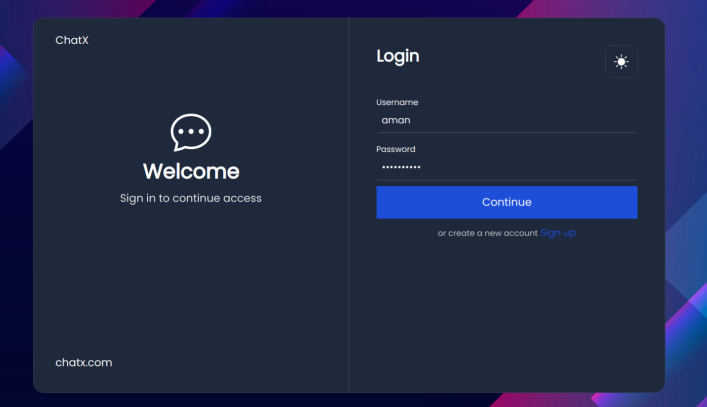
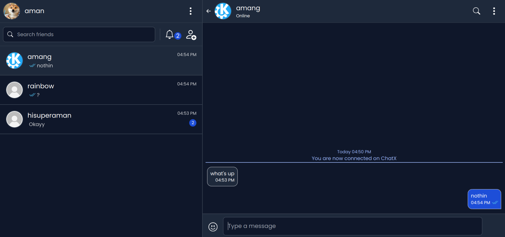

# MERN Chat Application

## Description

This is a real-time chat application built using the MERN stack (MongoDB, Express.js, React.js, Node.js). It allows users to create accounts, send and receive friend requests, and send and receive messages in real time.

## Features

- Real-time messaging using **Socket.io**
- User authentication (JWT)
- MongoDB for message storage
- Users need to be friends to communicate
- Message status like sending, sent, delivered, read are visible to users
- Last seen and online status is visible to friends of a user
- Reconnect to a friend by sending request to unfriended user (messages persist)
- Infinite scrolling
- Notification system, like to notify one user that another user has sent them a request
- User-friendly React frontend
- Responsive user interface
- Has dual themes, dark mode and light mode

## Screenshots

### 1. Login Page


### 2. Chat Interface


## Tech Stack

- **MongoDB**: For storing user data and chat messages
- **Express.js**: Backend API and routing
- **React.js**: Frontend user interface
- **Node.js**: Backend server
- **Socket.io**: Real-time communication

## Installation

1. Clone the repository:
   ```bash
   git clone https://github.com/hisuperaman/chatX.git .
2. Install dependencies for both the server and client:
    ```bash
    cd client
    npm install
    cd server
    npm install 
3. Create a .env file in the root directory and add the following variables:
    ```bash
    DB_URI = your_mongodb_connection_string

    PORT = port_for_server # e.g., 8000

    CLIENT_URL = react_frontend_url # e.g., 'http://localhost:3000'

    MAIL_SERVICE = your_mail_service # e.g., Gmail
    MAIL_USER = your_email
    MAIL_PASS = your_password # app password for gmail

    SECRET_KEY = your_secret_key # e.g., secret!
## Running the Project

1. Start the server:
   ```bash
   cd server
   npm run start # for nodemon: npm run dev
2. Start the client:
   ```bash
   cd client
   npm run start
## Contributing

Contributions are welcome! Feel free to submit a pull request or open an issue.

## License

This project is licensed under the MIT License.